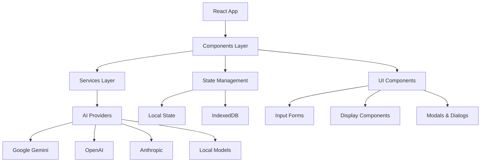
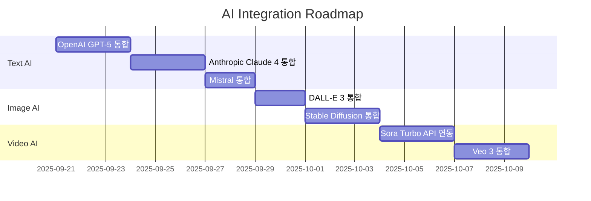
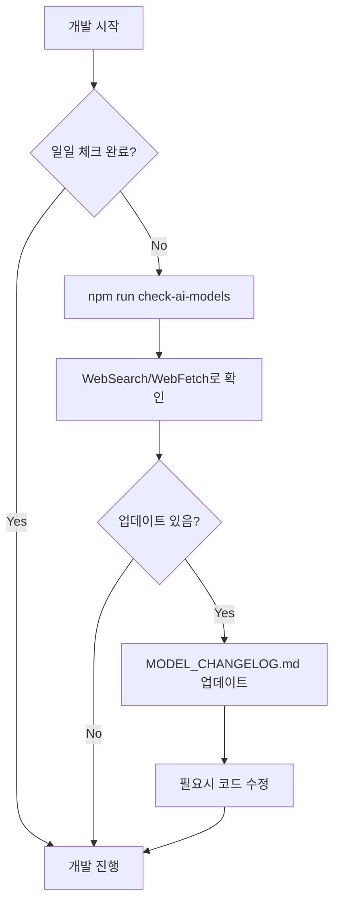

# ARTIFEX.AI STUDIO PRO - 종합 프로젝트 개발 가이드

## 🚀 프로젝트 개요

**프로젝트명**: Artifex.AI Studio Pro  
**버전**: 0.0.0  
**타입**: AI 기반 멀티미디어 콘텐츠 생성 플랫폼  
**기술 스택**: React 19 + TypeScript + Vite + Google Generative AI

### 핵심 가치
- 🎨 **창의적 AI 콘텐츠 생성**: Text, Image, Video, Art
- 🎬 **전문가급 스토리보드**: 영화/광고 제작용 시각화
- 🖼️ **미디어 아트**: AI 기반 예술 작품 생성
- 🎭 **비주얼 아트**: 유명 작품 스타일 변환
- 🌍 **다국어 지원**: 한국어/영어 완벽 지원

---

## ⏰ 날짜 및 시간대 인식

### 중요: 정확한 날짜 확인
**현재 날짜**: 시스템 `date` 명령어로 항상 확인
**시간대**: 한국/서울 (KST, UTC+9)
**마지막 확인**: 2025년 9월 20일 토요일

```bash
# 개발 시작 시 날짜 확인 (필수)
date '+%Y년 %m월 %d일 %A'
```

⚠️ **주의사항**:
- 환경 변수의 날짜가 아닌 실제 시스템 날짜를 사용
- 모든 문서 작성 시 현재 날짜 확인 후 기록
- 한국 시간대(KST) 기준으로 작업

---

## 🏗️ 기술 아키텍처

### Frontend Architecture


### Core Modules
1. **Components (31개)**: UI 컴포넌트 라이브러리
2. **Services (12개)**: 비즈니스 로직 및 AI 통합
3. **AI Providers**: 다중 AI 제공자 통합
4. **Database**: IndexedDB 기반 로컬 저장소
5. **Internationalization**: 다국어 지원 시스템

### 프로젝트 구조
```
artifex.ai-studio-pro/
├── App.tsx                      # 메인 애플리케이션
├── components/                  # React 컴포넌트
│   ├── storyboard/             # 스토리보드 관련
│   ├── icons/                  # 아이콘 컴포넌트
│   └── ...                     # 기타 UI 컴포넌트
├── services/                    # 비즈니스 로직
│   ├── aiProviders/            # AI 제공업체별 서비스
│   ├── geminiService.ts        # Google Gemini 통합
│   ├── db.ts                   # IndexedDB 관리
│   └── ...                     # 기타 서비스
├── i18n/                       # 다국어 지원
│   └── translations/           # 번역 파일
├── docs/
│   └── ai-models/              # AI 모델 문서
│       ├── AI_MODEL_INTEGRATION_PLAN.md
│       └── MODEL_CHANGELOG.md
├── scripts/                    # 유틸리티 스크립트
└── Models/                     # 로컬 AI 모델 (gitignored)
```

---

## 📊 현재 구현 상태

### ✅ 완료된 기능
- **Description Mode**: 제품 설명 자동 생성
- **Storyboard Mode**: 시나리오 기반 스토리보드 생성
- **Media Art Mode**: AI 기반 미디어 아트 생성
- **Visual Art Mode**: 예술 작품 스타일 변환
- **Google Gemini 2.0 Flash**: 최신 모델 통합
- **다국어 지원**: 한국어/영어 전환
- **프로젝트 관리**: 로컬 DB 저장/불러오기
- **갤러리**: 샘플 및 생성 작품 관리

### 🔄 진행 중
- **OpenAI GPT-5 통합**: 최신 플래그십 모델
- **Anthropic Claude 4 통합**: Opus 4.1, Sonnet 4
- **Wan2.2 로컬 모델**: 오프라인 비디오 생성
- **Professional Mode**: 전문가용 고급 기능
- **Character Consistency**: 캐릭터 일관성 유지
- **Style Guide Manager**: 스타일 가이드 관리

### ❌ 미구현
- **Video Generation**: 실제 비디오 생성
- **Audio Integration**: 음성/음악 통합
- **Cloud Storage**: 클라우드 저장소 연동
- **Collaboration**: 다중 사용자 협업
- **Export Options**: 다양한 포맷 내보내기
- **Payment System**: 결제 시스템 통합

---

## 🚨 개발 시작 전 필수 확인사항

### AI 모델 최신 버전 체크 (매일 실행)
```bash
# 1단계: 최신 모델 확인
npm run check-ai-models

# 2단계: SDK 버전 확인
npm run check-sdk-versions

# 3단계: 전체 통합 체크
npm run full-update-check

# 4단계: 업데이트 필요시 실행
npm run update-ai-models    # 모델 문서 업데이트
npm run update-sdks         # SDK 패키지 업데이트

# 5단계: 변경사항 확인
cat docs/ai-models/MODEL_CHANGELOG.md | head -30
```

### 자동 체크 항목
1. **모델 버전**: 각 제공업체의 최신 모델 확인
2. **SDK 버전**: NPM 패키지 최신 버전 확인
3. **API 변경**: Breaking changes 확인
4. **가격 변경**: 비용 구조 변경 확인
5. **신규 기능**: 새로운 파라미터나 기능 확인
6. **Deprecation**: 지원 중단 예정 모델 확인

---

## 🎯 개발 우선순위 및 로드맵

### Phase 1: Core AI Integration (1-2주)


### Phase 2: Professional Features (2-3주)
- [ ] Professional Storyboard Creator 완성
- [ ] Character Consistency Engine 구현
- [ ] Style Guide Manager 고도화
- [ ] Advanced Prompt Engineering
- [ ] Batch Processing 시스템

### Phase 3: Local Model Integration (1주)
- [ ] Wan2.2 Python 서버 구축
- [ ] GPU 자동 감지 시스템
- [ ] 하이브리드 모드 구현
- [ ] 성능 최적화

### Phase 4: Production Ready (2-3주)
- [ ] 전체 테스트 스위트 구축
- [ ] 성능 최적화 및 코드 정리
- [ ] 보안 감사 및 취약점 수정
- [ ] 문서화 완성
- [ ] 배포 파이프라인 구축

---

## 🎯 Active Development Plan

### Current Focus: AI Model Integration
- **Master Plan**: [AI_MODEL_INTEGRATION_PLAN.md](./docs/ai-models/AI_MODEL_INTEGRATION_PLAN.md)
- **Change Log**: [MODEL_CHANGELOG.md](./docs/ai-models/MODEL_CHANGELOG.md)
- **Last Updated**: 2025-09-20

### Critical Development References
When working on AI model features, ALWAYS reference:
1. Check [AI_MODEL_INTEGRATION_PLAN.md](./docs/ai-models/AI_MODEL_INTEGRATION_PLAN.md) for:
   - Model inventory and capabilities
   - Implementation roadmap
   - API integration patterns
   - File structure guidelines
   - Testing procedures

2. Check [MODEL_CHANGELOG.md](./docs/ai-models/MODEL_CHANGELOG.md) for:
   - Latest model versions
   - Recent changes and updates
   - Deprecation notices
   - Performance benchmarks

---

## 📋 Development Checklist

### Before Starting Any AI-Related Development:
- [ ] Review docs/ai-models/AI_MODEL_INTEGRATION_PLAN.md
- [ ] Check docs/ai-models/MODEL_CHANGELOG.md for updates
- [ ] Run `npm run check-ai-models`
- [ ] Verify API keys are configured
- [ ] Check current implementation status
- [ ] Follow established patterns

### During Development:
- [ ] Use TodoWrite tool to track progress
- [ ] Update documentation as you code
- [ ] Test with multiple models
- [ ] Handle errors gracefully
- [ ] Log model usage for cost tracking

### After Development:
- [ ] Run all tests
- [ ] Update docs/ai-models/MODEL_CHANGELOG.md if needed
- [ ] Verify all models work correctly
- [ ] Document any deviations from plan
- [ ] Commit with clear messages

---

## 🔄 모델 업데이트 워크플로우



### 모델 업데이트 체크 URL
각 제공업체의 최신 정보는 아래 URL에서 확인:
- OpenAI: https://platform.openai.com/docs/models
- Anthropic: https://docs.anthropic.com/claude/docs/models-overview
- Google: https://ai.google.dev/gemini-api/docs/models
- Mistral: https://docs.mistral.ai/platform/endpoints
- Stability AI: https://platform.stability.ai/docs/models

---

## 🚀 Quick Commands

### 개발 명령어
```bash
# 개발 서버 실행
npm run dev

# 빌드
npm run build

# 프리뷰
npm run preview
```

### AI 모델 관련 명령어
```bash
# 모델 업데이트 체크
npm run check-ai-models

# SDK 버전 체크
npm run check-sdk-versions

# 전체 통합 체크 (모델 + SDK)
npm run full-update-check

# 문서 업데이트
npm run update-ai-docs

# SDK 패키지 업데이트
npm run update-sdks

# 상세 보고서 생성
npm run ai-model-report

# 테스트 실행
npm test
```

---

## 📊 AI 모델 통합 현황

### Text AI (확인된 최신 모델 - 2025년 9월 20일)
- ✅ Gemini 2.0 Flash (기본 통합 완료)
- 🔄 GPT-5 (통합 예정) - 최신 플래그십
- 🔄 GPT-4.5, GPT-4.1 (통합 예정)
- 🔄 Gemini 2.5 Pro/Flash (통합 예정) - Thinking 기능
- ✅ Claude 4 시리즈 (Opus 4.1, Sonnet 4) - 이미 출시, 사용 가능
- ✅ Claude 3.7 Sonnet - 2025년 2월 출시, 사용 가능
- 🔄 Claude 3.5 (통합 예정)
- 🔄 Mistral (통합 예정)

### Image AI
- 🔄 Imagen 4 (Ultra/Standard/Fast) - Google 최신
- ❌ DALL-E 3 (미구현)
- ❌ Stable Diffusion (미구현)
- ❌ Flux (미구현)

### Video AI (2025년 9월 20일 기준)
- ✅ OpenAI Sora Turbo (2024년 12월 출시) - ChatGPT Plus/Pro에서 사용 가능
- ✅ Google Veo 3 (2025년 5월 출시) - 오디오 지원, 4K
- ✅ Google Veo 2 (2024년 12월 출시) - 4K, 향상된 물리
- ✅ Wan2.2 로컬 모델 - 19GB, MoE, RTX 4090
- ✅ Pika 2.2/2.1 - 1080p, 10초 비디오
- ✅ Luma Ray 2 - 리얼리즘 벤치마크
- 🔄 Runway Gen-3 Alpha (통합 예정)
- 🔄 Stable Video Diffusion (통합 예정)
- ✅ Kling AI 2.1, Hailuo AI - 사용 가능

---

## 🔑 API Key Management

### 필요한 API 키
```env
# .env 파일
VITE_OPENAI_API_KEY=sk-...
VITE_ANTHROPIC_API_KEY=sk-ant-...
VITE_GEMINI_API_KEY=...
VITE_MISTRAL_API_KEY=...
VITE_STABILITY_API_KEY=...
VITE_REPLICATE_API_KEY=...
```

### API 키 보안 주의사항
1. 절대 코드에 직접 입력하지 않기
2. .env 파일은 .gitignore에 추가
3. 프로덕션에서는 환경 변수 사용
4. 정기적으로 키 로테이션

---

## 💼 비즈니스 모델 및 수익화

### 수익 모델
1. **Freemium**: 기본 기능 무료, 고급 기능 유료
2. **API Credits**: AI API 사용량 기반 과금
3. **Pro Subscription**: 월간/연간 구독
4. **Enterprise**: 기업용 맞춤 솔루션
5. **Local Model License**: 로컬 모델 라이센스 판매

### 타겟 시장
- **콘텐츠 크리에이터**: 유튜버, 블로거
- **광고 대행사**: 스토리보드 제작
- **영화 제작사**: 프리 프로덕션
- **교육 기관**: 창의적 학습 도구
- **기업 마케팅팀**: 제품 홍보 콘텐츠

---

## 📚 Error Prevention Guidelines

### 🚨 매우 중요한 개발 지침 - AI 모델 처리
**절대적 원칙: 모델 자동 대체/치환 금지**
1. **절대로 모델을 임의로 대체하지 않는다** - 사용자가 선택한 정확한 모델을 그대로 사용
2. **모델이 작동하지 않으면 그대로 보고한다** - "이 모델 대신 다른 모델을 사용합니다" 같은 자동 대체 금지
3. **정확한 에러 상황을 그대로 전달한다** - 모델이 인식되지 않거나 지원되지 않으면 그 사실을 명확히 전달
4. **사용자 경험 개선이라는 명목으로 자동 변환하지 않는다** - 모든 모델 관련 결정은 사용자의 명시적 선택을 따른다

예시:
- ❌ 잘못된 방식: "gemini-2.5-flash가 없어서 gemini-2.0-flash-exp로 대체합니다"
- ✅ 올바른 방식: "gemini-2.5-flash 모델이 API에서 인식되지 않습니다"

### 🔥 문제 해결 원칙 - 절대 게으른 해결책 금지
**2025년 9월 20일 Gemini 2.5 Flash 사건에서 배운 교훈**

#### ❌ 절대 하지 말아야 할 것들:
1. **대충 판단하고 쉬운 방법으로 우회하기**
   - 잘못된 예: "모델이 안 되니까 다른 모델로 자동 대체하자"
   - 올바른 예: 실제 원인(토큰 제한, API 응답 구조 등) 파악

2. **근거 없는 추측으로 해결하기**
   - 잘못된 예: "아마 2.5는 2.0의 마케팅 이름일 거야"
   - 올바른 예: 공식 문서 확인, API 응답 디버깅

3. **표면적 증상만 보고 빠른 해결책 찾기**
   - 잘못된 예: "빈 응답이니까 모델이 없는 거야"
   - 올바른 예: 응답 구조 분석, finishReason 확인, 토큰 제한 체크

#### ✅ 올바른 문제 해결 절차:
1. **정확한 로그 분석** - console.log로 전체 응답 구조 확인
2. **공식 문서 검증** - 추측 대신 공식 문서에서 정확한 정보 확인
3. **단계적 디버깅** - 문제의 근본 원인을 찾을 때까지 포기하지 않기
4. **사용자 의도 존중** - 편의를 위한 자동 변경 절대 금지

### 🎨 Google 이미지 생성 API 사용법 (2025년 9월 20일 확인)
**중요: Google의 Imagen 4.0과 Gemini Flash Image 모델들은 실제로 API를 통해 사용 가능합니다!**

#### 사용 가능한 Google 이미지 모델
1. **Imagen 4.0 시리즈**
   - `imagen-4.0-generate-001` - 플래그십 모델 ($0.04/이미지)
   - `imagen-4-fast` - 빠른 생성 ($0.02/이미지)
   - `imagen-4-ultra` - 최고 품질 (Premium)

2. **Gemini Flash Image**
   - `gemini-2.5-flash-image-preview` - 멀티모달 이미지 생성 ($0.039/이미지)
   - 텍스트와 이미지를 함께 생성 가능

#### 올바른 구현 방법
```typescript
// Imagen 4.0 사용
const model = genAI.getGenerativeModel({ 
    model: "imagen-4.0-generate-001" 
});

// Gemini Flash Image 사용
const model = genAI.getGenerativeModel({ 
    model: "gemini-2.5-flash-image-preview" 
});
```

#### 지원되는 종횡비
- `1:1` (Square), `4:3` (Fullscreen), `3:4` (Portrait)
- `16:9` (Widescreen), `9:16` (Portrait widescreen)

📚 **상세 문서**: [GOOGLE_IMAGE_GENERATION_API.md](./docs/ai-models/GOOGLE_IMAGE_GENERATION_API.md)

### AI 서비스 개발시 주의사항
1. **Always check the integration plan** before modifying AI services
2. **Use established patterns** from the plan
3. **Test with multiple models** before committing
4. **Document any deviations** from the plan
5. **Handle rate limits** gracefully
6. **Never implement automatic model substitution** - 절대 자동 모델 대체 금지
7. **Debug thoroughly before proposing workarounds** - 우회책 제안 전 철저한 디버깅
8. **Google Image API는 실제로 작동함** - "not available" 에러는 구현 문제

### 일반적인 오류와 해결법
| 오류 | 원인 | 해결 방법 |
|------|------|-----------|
| API Key Error | 잘못된 키 | .env 파일 확인 |
| Rate Limit | 과도한 요청 | Retry 로직 추가 |
| Model Not Found | 구버전 사용 | 최신 모델로 업데이트 |
| Timeout | 네트워크 지연 | 타임아웃 증가 |
| Empty Response (Gemini 2.5) | MAX_TOKENS 도달 | maxTokens를 8192 이상으로 증가 |
| Thinking Mode Issues | 토큰 소비 과다 | Gemini 2.5의 thinking 기능 고려한 토큰 설정 |

---

## 🎨 UI/UX Guidelines

### AI 모델 선택 UI
- 제공업체별로 그룹화된 드롭다운
- API 키 상태 표시 (✅/❌)
- 모델 특징 툴팁 (컨텍스트, 속도, 비용)
- 실시간 가용성 체크

### 사용자 피드백
- 모델 로딩 상태 표시
- 에러 메시지 명확하게
- 대안 모델 제안
- 비용 추정치 표시

---

## 📈 Performance Considerations

### 최적화 전략
1. **API 호출 캐싱**: 동일한 요청 캐시
2. **배치 처리**: 가능한 경우 배치 API 사용
3. **스트리밍**: 긴 응답에 스트리밍 사용
4. **비동기 처리**: 병렬 요청 처리

### 모니터링
- API 호출 횟수 추적
- 응답 시간 측정
- 에러율 모니터링
- 비용 추적

---

## 🧪 Testing Strategy

### 테스트 레벨
1. **Unit Tests**: 각 서비스 개별 테스트
2. **Integration Tests**: AI Router 테스트
3. **E2E Tests**: 전체 플로우 테스트
4. **Performance Tests**: 응답 시간 및 처리량

### 테스트 실행
```bash
# 모든 테스트
npm test

# 단위 테스트만
npm run test:unit

# 통합 테스트만
npm run test:integration

# E2E 테스트
npm run test:e2e
```

---

## 📝 Commit Guidelines

### 커밋 메시지 형식
```
<type>(<scope>): <subject>

<body>

<footer>
```

### Types
- **feat**: 새로운 기능
- **fix**: 버그 수정
- **docs**: 문서 변경
- **style**: 코드 스타일 변경
- **refactor**: 리팩토링
- **test**: 테스트 추가/수정
- **chore**: 기타 변경

### 예시
```
feat(ai): Add OpenAI GPT-5 integration

- Implemented OpenAI service provider
- Added model selection in UI
- Updated aiRouter to handle OpenAI models

Refs: docs/ai-models/AI_MODEL_INTEGRATION_PLAN.md
```

---

## 🔧 Troubleshooting

### 자주 발생하는 문제

#### 1. Import 오류
```
Error: Failed to resolve import "@google/genai"
```
**해결**: 올바른 패키지명 사용 (`@google/generative-ai`)

#### 2. API 키 인식 못함
```
Error: API key not found
```
**해결**: 
- `.env` 파일 확인
- `VITE_` 접두사 확인
- 개발 서버 재시작

#### 3. CORS 오류
```
Error: CORS policy blocked
```
**해결**: 
- 백엔드 프록시 설정
- API 직접 호출 대신 서버 경유

---

## 🚀 즉시 실행 가능한 작업

### Today (2025-09-20)
- [ ] OpenAI Service 구현 시작
- [ ] API 키 관리 UI 개선
- [ ] Professional Mode UI 프로토타입

### This Week
- [ ] 3개 이상 AI 제공자 통합 완료
- [ ] Character Consistency 알고리즘 설계
- [ ] 테스트 커버리지 50% 달성

### This Month
- [ ] 전체 AI 모델 통합 완료
- [ ] Professional Features 구현
- [ ] Beta 버전 출시 준비

---

## 📞 Support & Resources

### 내부 문서
- [AI_MODEL_INTEGRATION_PLAN.md](./docs/ai-models/AI_MODEL_INTEGRATION_PLAN.md)
- [MODEL_CHANGELOG.md](./docs/ai-models/MODEL_CHANGELOG.md)

### 외부 리소스
- [OpenAI Discord](https://discord.com/invite/openai)
- [Anthropic Community](https://www.anthropic.com/community)
- [Google AI Forum](https://groups.google.com/g/google-ai-dev)

### 이슈 트래킹
- GitHub Issues: [프로젝트 저장소]
- 내부 Slack: #ai-integration

---

## 🎯 Next Steps

1. **즉시 실행**:
   - [ ] `npm run check-ai-models` 실행
   - [ ] docs/ai-models/AI_MODEL_INTEGRATION_PLAN.md 검토

2. **단기 (1주일)**:
   - [ ] OpenAI 통합 구현
   - [ ] Anthropic 통합 구현
   - [ ] UI 컴포넌트 완성

3. **중기 (2주일)**:
   - [ ] Image AI 통합
   - [ ] Video AI 통합
   - [ ] 전체 테스트

4. **장기 (1개월)**:
   - [ ] 성능 최적화
   - [ ] 비용 최적화
   - [ ] 프로덕션 배포

---

*이 문서는 Artifex.AI Studio Pro의 핵심 개발 가이드입니다.*
*개발자는 프로젝트 시작 시 이 문서를 참조하여 전체 맥락을 파악해야 합니다.*
*최종 업데이트: 2025년 9월 20일 토요일*