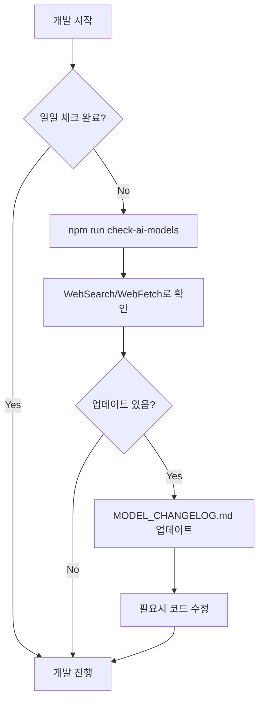

# Claude Code Development Guidelines

## ⏰ 날짜 및 시간대 인식

### 중요: 정확한 날짜 확인
**현재 날짜**: 시스템 `date` 명령어로 항상 확인
**시간대**: 한국/서울 (KST, UTC+9)
**마지막 확인**: 2025년 9월 20일 토요일

```bash
# 개발 시작 시 날짜 확인 (필수)
date '+%Y년 %m월 %d일 %A'
```

⚠️ **주의사항**:
- 환경 변수의 날짜가 아닌 실제 시스템 날짜를 사용
- 모든 문서 작성 시 현재 날짜 확인 후 기록
- 한국 시간대(KST) 기준으로 작업

## 🚨 개발 시작 전 필수 확인사항

### AI 모델 최신 버전 체크 (매일 실행)
```bash
# 1단계: 최신 모델 확인
npm run check-ai-models

# 2단계: SDK 버전 확인
npm run check-sdk-versions

# 3단계: 전체 통합 체크
npm run full-update-check

# 4단계: 업데이트 필요시 실행
npm run update-ai-models    # 모델 문서 업데이트
npm run update-sdks         # SDK 패키지 업데이트

# 5단계: 변경사항 확인
cat docs/ai-models/MODEL_CHANGELOG.md | head -30
```

### 자동 체크 항목
1. **모델 버전**: 각 제공업체의 최신 모델 확인
2. **SDK 버전**: NPM 패키지 최신 버전 확인
3. **API 변경**: Breaking changes 확인
4. **가격 변경**: 비용 구조 변경 확인
5. **신규 기능**: 새로운 파라미터나 기능 확인
6. **Deprecation**: 지원 중단 예정 모델 확인

---

## 🎯 Active Development Plan

### Current Focus: AI Model Integration
- **Master Plan**: [AI_MODEL_INTEGRATION_PLAN.md](./docs/ai-models/AI_MODEL_INTEGRATION_PLAN.md)
- **Change Log**: [MODEL_CHANGELOG.md](./docs/ai-models/MODEL_CHANGELOG.md)
- **Last Updated**: 2025-09-20

### Critical Development References
When working on AI model features, ALWAYS reference:
1. Check [AI_MODEL_INTEGRATION_PLAN.md](./docs/ai-models/AI_MODEL_INTEGRATION_PLAN.md) for:
   - Model inventory and capabilities
   - Implementation roadmap
   - API integration patterns
   - File structure guidelines
   - Testing procedures

2. Check [MODEL_CHANGELOG.md](./docs/ai-models/MODEL_CHANGELOG.md) for:
   - Latest model versions
   - Recent changes and updates
   - Deprecation notices
   - Performance benchmarks

---

## 📋 Development Checklist

### Before Starting Any AI-Related Development:
- [ ] Review docs/ai-models/AI_MODEL_INTEGRATION_PLAN.md
- [ ] Check docs/ai-models/MODEL_CHANGELOG.md for updates
- [ ] Run `npm run check-ai-models`
- [ ] Verify API keys are configured
- [ ] Check current implementation status
- [ ] Follow established patterns

### During Development:
- [ ] Use TodoWrite tool to track progress
- [ ] Update documentation as you code
- [ ] Test with multiple models
- [ ] Handle errors gracefully
- [ ] Log model usage for cost tracking

### After Development:
- [ ] Run all tests
- [ ] Update docs/ai-models/MODEL_CHANGELOG.md if needed
- [ ] Verify all models work correctly
- [ ] Document any deviations from plan
- [ ] Commit with clear messages

---

## 🔄 모델 업데이트 워크플로우



### 모델 업데이트 체크 URL
각 제공업체의 최신 정보는 아래 URL에서 확인:
- OpenAI: https://platform.openai.com/docs/models
- Anthropic: https://docs.anthropic.com/claude/docs/models-overview
- Google: https://ai.google.dev/gemini-api/docs/models
- Mistral: https://docs.mistral.ai/platform/endpoints
- Stability AI: https://platform.stability.ai/docs/models

---

## 🏗️ Project Structure

```
artifex.ai-studio-pro/
├── claude.md                     # 이 파일 (루트에 유지)
├── docs/
│   ├── ai-models/
│   │   ├── AI_MODEL_INTEGRATION_PLAN.md  # 마스터 플랜
│   │   └── MODEL_CHANGELOG.md            # 변경 이력
│   └── project/
│       └── README.md                      # 프로젝트 설명
├── services/
│   ├── providers/               # AI 제공업체별 서비스
│   │   ├── text/               # Text AI
│   │   ├── image/              # Image AI
│   │   └── video/              # Video AI
│   └── core/                   # 핵심 서비스
│       ├── aiRouter.ts         # AI 라우터
│       └── modelUpdateChecker.ts # 모델 업데이트 체커
└── scripts/
    └── checkModelUpdates.ts    # 자동 체크 스크립트
```

---

## 🚀 Quick Commands

### AI 모델 관련 명령어
```bash
# 모델 업데이트 체크
npm run check-ai-models

# SDK 버전 체크
npm run check-sdk-versions

# 전체 통합 체크 (모델 + SDK)
npm run full-update-check

# 문서 업데이트
npm run update-ai-docs

# SDK 패키지 업데이트
npm run update-sdks

# 상세 보고서 생성
npm run ai-model-report

# 개발 서버 실행
npm run dev

# 테스트 실행
npm test
```

---

## 📊 현재 통합 상태

### Text AI (확인된 최신 모델 - 2025년 9월 20일)
- ✅ Gemini 2.0 Flash (기본 통합 완료)
- 🔄 GPT-5 (통합 예정) - 최신 플래그십
- 🔄 GPT-4.5, GPT-4.1 (통합 예정)
- 🔄 Gemini 2.5 Pro/Flash (통합 예정) - Thinking 기능
- ✅ Claude 4 시리즈 (Opus 4.1, Sonnet 4) - 이미 출시, 사용 가능
- ✅ Claude 3.7 Sonnet - 2025년 2월 출시, 사용 가능
- 🔄 Claude 3.5 (통합 예정)
- 🔄 Mistral (통합 예정)

### Image AI
- 🔄 Imagen 4 (Ultra/Standard/Fast) - Google 최신
- ❌ DALL-E 3 (미구현)
- ❌ Stable Diffusion (미구현)
- ❌ Flux (미구현)

### Video AI (2025년 9월 20일 기준)
- ✅ OpenAI Sora Turbo (2024년 12월 출시) - ChatGPT Plus/Pro에서 사용 가능
- ✅ Google Veo 3 (2025년 5월 출시) - 오디오 지원, 4K
- ✅ Google Veo 2 (2024년 12월 출시) - 4K, 향상된 물리
- ✅ Pika 2.2/2.1 - 1080p, 10초 비디오
- ✅ Luma Ray 2 - 리얼리즘 벤치마크
- 🔄 Runway Gen-3 Alpha (통합 예정)
- 🔄 Stable Video Diffusion (통합 예정)
- ✅ Kling AI 2.1, Hailuo AI - 사용 가능

---

## 🔑 API Key Management

### 필요한 API 키
```env
# .env 파일
VITE_OPENAI_API_KEY=sk-...
VITE_ANTHROPIC_API_KEY=sk-ant-...
VITE_GEMINI_API_KEY=...
VITE_MISTRAL_API_KEY=...
VITE_STABILITY_API_KEY=...
VITE_REPLICATE_API_KEY=...
```

### API 키 보안 주의사항
1. 절대 코드에 직접 입력하지 않기
2. .env 파일은 .gitignore에 추가
3. 프로덕션에서는 환경 변수 사용
4. 정기적으로 키 로테이션

---

## 📚 Error Prevention Guidelines

### AI 서비스 개발시 주의사항
1. **Always check the integration plan** before modifying AI services
2. **Use established patterns** from the plan
3. **Test with multiple models** before committing
4. **Document any deviations** from the plan
5. **Handle rate limits** gracefully
6. **Implement fallback models** for reliability

### 일반적인 오류와 해결법
| 오류 | 원인 | 해결 방법 |
|------|------|-----------|
| API Key Error | 잘못된 키 | .env 파일 확인 |
| Rate Limit | 과도한 요청 | Retry 로직 추가 |
| Model Not Found | 구버전 사용 | 최신 모델로 업데이트 |
| Timeout | 네트워크 지연 | 타임아웃 증가 |

---

## 🎨 UI/UX Guidelines

### AI 모델 선택 UI
- 제공업체별로 그룹화된 드롭다운
- API 키 상태 표시 (✅/❌)
- 모델 특징 툴팁 (컨텍스트, 속도, 비용)
- 실시간 가용성 체크

### 사용자 피드백
- 모델 로딩 상태 표시
- 에러 메시지 명확하게
- 대안 모델 제안
- 비용 추정치 표시

---

## 📈 Performance Considerations

### 최적화 전략
1. **API 호출 캐싱**: 동일한 요청 캐시
2. **배치 처리**: 가능한 경우 배치 API 사용
3. **스트리밍**: 긴 응답에 스트리밍 사용
4. **비동기 처리**: 병렬 요청 처리

### 모니터링
- API 호출 횟수 추적
- 응답 시간 측정
- 에러율 모니터링
- 비용 추적

---

## 🧪 Testing Strategy

### 테스트 레벨
1. **Unit Tests**: 각 서비스 개별 테스트
2. **Integration Tests**: AI Router 테스트
3. **E2E Tests**: 전체 플로우 테스트
4. **Performance Tests**: 응답 시간 및 처리량

### 테스트 실행
```bash
# 모든 테스트
npm test

# 단위 테스트만
npm run test:unit

# 통합 테스트만
npm run test:integration

# E2E 테스트
npm run test:e2e
```

---

## 📝 Commit Guidelines

### 커밋 메시지 형식
```
<type>(<scope>): <subject>

<body>

<footer>
```

### Types
- **feat**: 새로운 기능
- **fix**: 버그 수정
- **docs**: 문서 변경
- **style**: 코드 스타일 변경
- **refactor**: 리팩토링
- **test**: 테스트 추가/수정
- **chore**: 기타 변경

### 예시
```
feat(ai): Add OpenAI GPT-4o integration

- Implemented OpenAI service provider
- Added model selection in UI
- Updated aiRouter to handle OpenAI models

Refs: docs/ai-models/AI_MODEL_INTEGRATION_PLAN.md
```

---

## 🔧 Troubleshooting

### 자주 발생하는 문제

#### 1. Import 오류
```
Error: Failed to resolve import "@google/genai"
```
**해결**: 올바른 패키지명 사용 (`@google/generative-ai`)

#### 2. API 키 인식 못함
```
Error: API key not found
```
**해결**: 
- `.env` 파일 확인
- `VITE_` 접두사 확인
- 개발 서버 재시작

#### 3. CORS 오류
```
Error: CORS policy blocked
```
**해결**: 
- 백엔드 프록시 설정
- API 직접 호출 대신 서버 경유

---

## 📞 Support & Resources

### 내부 문서
- [AI_MODEL_INTEGRATION_PLAN.md](./docs/ai-models/AI_MODEL_INTEGRATION_PLAN.md)
- [MODEL_CHANGELOG.md](./docs/ai-models/MODEL_CHANGELOG.md)

### 외부 리소스
- [OpenAI Discord](https://discord.com/invite/openai)
- [Anthropic Community](https://www.anthropic.com/community)
- [Google AI Forum](https://groups.google.com/g/google-ai-dev)

### 이슈 트래킹
- GitHub Issues: [프로젝트 저장소]
- 내부 Slack: #ai-integration

---

## 🎯 Next Steps

1. **즉시 실행**:
   - [ ] `npm run check-ai-models` 실행
   - [ ] docs/ai-models/AI_MODEL_INTEGRATION_PLAN.md 검토

2. **단기 (1주일)**:
   - [ ] OpenAI 통합 구현
   - [ ] Anthropic 통합 구현
   - [ ] UI 컴포넌트 완성

3. **중기 (2주일)**:
   - [ ] Image AI 통합
   - [ ] Video AI 통합
   - [ ] 전체 테스트

4. **장기 (1개월)**:
   - [ ] 성능 최적화
   - [ ] 비용 최적화
   - [ ] 프로덕션 배포

---

*이 문서는 개발자가 프로젝트를 재시작할 때마다 참조해야 할 핵심 가이드입니다.*
*최종 업데이트: 2025년 9월 20일 토요일*