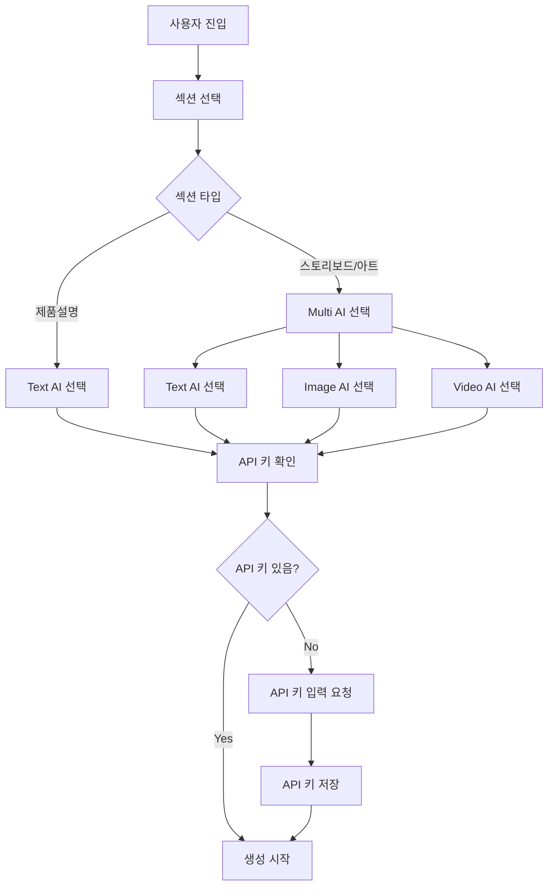
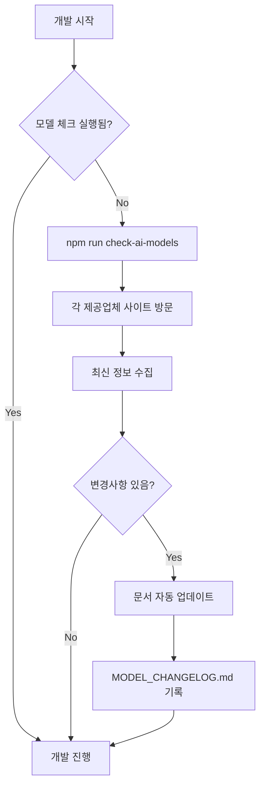

# AI 모델 통합 구현 마스터 플랜

## 프로젝트: artifex.ai-studio-pro
## 버전: 1.0.0
## 작성일: 2025년 9월 19일
## 최종 업데이트: 2025년 9월 20일

---

## 🔄 자동 모델 업데이트 체크 시스템

### ⚠️ 작업 시작 전 필수 체크리스트
**중요**: 개발 시작 전 반드시 아래 단계를 실행하세요.

1. [ ] 모든 AI 제공업체 최신 모델 확인 (자동 스크립트 실행)
2. [ ] 변경사항 감지 및 문서 업데이트
3. [ ] 새 모델 통합 필요성 검토
4. [ ] API 변경사항 확인
5. [ ] 가격 정책 변경 확인

### 자동 체크 명령어
```bash
npm run check-ai-models  # 모든 모델 최신 버전 확인
npm run update-ai-docs   # 문서 자동 업데이트
npm run ai-model-report  # 상세 보고서 생성
```

---

## 📋 목차
1. [개요](#개요)
2. [현재 상태 분석](#현재-상태-분석)
3. [목표 아키텍처](#목표-아키텍처)
4. [AI 모델 인벤토리](#ai-모델-인벤토리)
5. [구현 로드맵](#구현-로드맵)
6. [기술 스택](#기술-스택)
7. [파일 구조](#파일-구조)
8. [API 통합 가이드](#api-통합-가이드)
9. [UI/UX 설계](#uiux-설계)
10. [테스트 계획](#테스트-계획)
11. [체크리스트](#체크리스트)

---

## 개요

### 프로젝트 목적
- 다중 AI 모델 지원 (Text, Image, Video)
- 각 섹션별 독립적인 모델 선택 기능
- 확장 가능한 아키텍처 구축
- 실시간 모델 업데이트 감지 시스템

### 핵심 요구사항

| 섹션 | Text AI | Image AI | Video AI | 비고 |
|------|---------|----------|----------|------|
| 제품설명 | ✅ | ❌ | ❌ | Text AI만 필요 |
| 스토리보드 | ✅ | ✅ | ✅ | 전체 파이프라인 필요 |
| 미디어아트 | ✅ | ✅ | ✅ | 예술적 생성 지원 |
| 비주얼아트 | ✅ | ✅ | ✅ | 모션 그래픽 지원 |

---

## 현재 상태 분석

### 현재 구현 상태
- ✅ Gemini API 기본 통합
- ⚠️ 하드코딩된 모델 선택
- ❌ 다중 AI 제공업체 미지원
- ❌ 동적 모델 선택 불가
- ❌ Image/Video AI 미구현 (placeholder)

### 문제점
1. 단일 AI 제공업체 의존성
2. 모델 선택 유연성 부족
3. API 키 관리 체계 미흡
4. 확장성 제한

### 개선 필요사항
1. 다중 AI 제공업체 통합
2. 동적 모델 선택 UI
3. 통합 API 키 관리 시스템
4. 모듈화된 서비스 아키텍처

---

## 목표 아키텍처

### 시스템 아키텍처
```
┌─────────────────────────────────────────┐
│            사용자 인터페이스             │
├─────────────────────────────────────────┤
│          AI 모델 선택 컴포넌트          │
├─────────────────────────────────────────┤
│            AI Router Service            │
├──────────┬──────────┬──────────────────┤
│  Text AI │ Image AI │   Video AI       │
├──────────┼──────────┼──────────────────┤
│ • OpenAI │ • DALL-E │ • Runway         │
│ • Claude │ • Stable │ • Pika           │
│ • Gemini │ • Flux   │ • Luma           │
│ • Mistral│ • Midjourney│ • Stability   │
│          │ • Imagen 4  │ • Veo 2/3     │
│          │             │ • Sora Turbo  │
│          │             │ • Wan2.2 (로컬)│
└──────────┴──────────┴──────────────────┘
```

### 데이터 흐름
```
클라우드 모델:
User Input → Model Selection → API Router → Cloud Provider Service → Response → UI Update

로컬 모델:
User Input → Model Selection → API Router → Local Model Service → GPU Execution → Response → UI Update
```

---

## 📍 AI 모델 제공업체 공식 문서 URL

### 필수 확인 사이트 (2025년 9월 20일 기준)

| 제공업체 | 모델 문서 URL | API 문서 URL | 변경 로그 URL |
|---------|-------------|------------|--------------|
| **OpenAI** | https://platform.openai.com/docs/models | https://platform.openai.com/docs/api-reference | https://platform.openai.com/docs/changelog |
| **Anthropic** | https://docs.anthropic.com/claude/docs/models-overview | https://docs.anthropic.com/claude/reference | https://docs.anthropic.com/claude/docs/changelog |
| **Google** | https://ai.google.dev/gemini-api/docs/models | https://ai.google.dev/api/rest | https://ai.google.dev/gemini-api/docs/changelog |
| **Mistral** | https://docs.mistral.ai/platform/endpoints | https://docs.mistral.ai/api | https://docs.mistral.ai/platform/changelog |
| **Stability AI** | https://platform.stability.ai/docs/models | https://platform.stability.ai/docs/api-reference | https://platform.stability.ai/changelog |
| **Runway** | https://docs.runwayml.com/models | https://docs.runwayml.com/api | https://docs.runwayml.com/changelog |
| **Replicate** | https://replicate.com/docs/models | https://replicate.com/docs/reference | https://replicate.com/changelog |
| **Cohere** | https://cohere.com/models | https://docs.cohere.com/reference | https://cohere.com/changelog |
| **Hugging Face** | https://huggingface.co/models | https://huggingface.co/docs/api-inference | https://huggingface.co/docs/hub/changelog |
| **Pika Labs** | https://pika.art/docs | https://docs.pika.art/api | https://pika.art/updates |
| **Luma AI** | https://lumalabs.ai/docs | https://docs.lumalabs.ai/api | https://lumalabs.ai/changelog |

---

## AI 모델 인벤토리 (2025년 9월 20일 기준)

### 📊 현재 통합된 모델 버전 상태

#### Text AI 모델

| 모델명 | 현재 버전 | 최신 버전 | 업데이트 날짜 | 상태 | 컨텍스트 | 비고 |
|-------|-----------|-----------|--------------|------|---------|------|
| **OpenAI** |
| GPT-4o | gpt-4o-2024-08-06 | [CHECK] | 2024-08-06 | ✅ | 128K | 최신 멀티모달 |
| GPT-4o-mini | gpt-4o-mini-2024-07-18 | [CHECK] | 2024-07-18 | ✅ | 128K | 경량화 버전 |
| GPT-4-turbo | gpt-4-turbo-preview | [CHECK] | 2024-01-25 | ✅ | 128K | |
| GPT-3.5-turbo | gpt-3.5-turbo-0125 | [CHECK] | 2024-01-25 | ✅ | 16K | |
| **Anthropic** |
| Claude 3.5 Sonnet | claude-3-5-sonnet-20241022 | [CHECK] | 2024-10-22 | ✅ | 200K | 최고 성능 |
| Claude 3.5 Haiku | claude-3-5-haiku-20241022 | [CHECK] | 2024-10-22 | ✅ | 200K | 빠른 응답 |
| Claude 3 Opus | claude-3-opus-20240229 | [CHECK] | 2024-02-29 | ✅ | 200K | |
| **Google** |
| Gemini 2.0 Flash | gemini-2.0-flash-exp | [CHECK] | 2024-12-11 | 🔄 | 1M | Experimental |
| Gemini 1.5 Pro | gemini-1.5-pro-latest | [CHECK] | 2024-12-01 | ✅ | 2M | 최대 컨텍스트 |
| Gemini 1.5 Flash | gemini-1.5-flash-latest | [CHECK] | 2024-12-01 | ✅ | 1M | |
| **Mistral** |
| Mistral Large | mistral-large-latest | [CHECK] | 2024-11-01 | ✅ | 128K | |
| Mistral Medium | mistral-medium-latest | [CHECK] | 2024-11-01 | ✅ | 32K | |
| Mistral Small | mistral-small-latest | [CHECK] | 2024-11-01 | ✅ | 32K | |

#### Image AI 모델

| 모델명 | 현재 버전 | 최신 버전 | 업데이트 날짜 | 상태 | 해상도 | 비고 |
|-------|-----------|-----------|--------------|------|---------|------|
| **OpenAI** |
| DALL-E 3 | dall-e-3 | [CHECK] | 2024-11-01 | ✅ | 1024x1024 | HD 지원 |
| DALL-E 2 | dall-e-2 | [CHECK] | 2023-01-01 | ✅ | 1024x1024 | |
| **Stability AI** |
| SDXL 1.0 | stable-diffusion-xl-1.0 | [CHECK] | 2024-07-01 | ✅ | 1024x1024 | |
| SD 3.0 | stable-diffusion-3.0 | [CHECK] | 2024-09-01 | ✅ | 1024x1024 | 최신 |
| **Flux** |
| Flux 1.1 Pro | flux-1.1-pro | [CHECK] | 2024-10-01 | ✅ | 2048x2048 | 최고 품질 |
| Flux 1 Schnell | flux-1-schnell | [CHECK] | 2024-08-01 | ✅ | 1024x1024 | 고속 |
| **Midjourney** |
| MJ v6.1 | midjourney-v6.1 | [CHECK] | 2024-09-01 | ✅ | 2048x2048 | Replicate API |

#### Video AI 모델

| 모델명 | 현재 버전 | 최신 버전 | 업데이트 날짜 | 상태 | 최대 길이 | 비고 |
|-------|-----------|-----------|--------------|------|-----------|------|
| **Runway** |
| Gen-3 Alpha | gen-3-alpha | [CHECK] | 2024-08-01 | ✅ | 10초 | 최신 |
| Gen-2 | gen-2 | [CHECK] | 2023-11-01 | ✅ | 4초 | |
| **Pika Labs** |
| Pika 1.0 | pika-1.0 | [CHECK] | 2024-07-01 | ✅ | 3초 | |
| **Stability AI** |
| SVD 1.1 | stable-video-1.1 | [CHECK] | 2024-06-01 | ✅ | 4초 | |
| **Luma AI** |
| Dream Machine | dream-machine-1.5 | [CHECK] | 2024-09-01 | ✅ | 5초 | |
| Ray 2 | luma-ray-2 | [CHECK] | 2025-02-01 | ✅ | 10초 | 리얼리즘 |
| **OpenAI** |
| Sora Turbo | sora-turbo | [CHECK] | 2024-12-09 | ✅ | 20초 | ChatGPT Plus/Pro |
| **Google** |
| Veo 2 | veo-2 | [CHECK] | 2024-12-01 | ✅ | 60초 | 4K, 향상된 물리 |
| Veo 3 | veo-3 | [CHECK] | 2025-05-01 | ✅ | 60초 | 4K, 오디오 지원 |
| **Pika** |
| Pika 2.1 | pika-2.1 | [CHECK] | 2025-01-01 | ✅ | 10초 | 1080p |
| Pika 2.2 | pika-2.2 | [CHECK] | 2025-03-01 | ✅ | 10초 | 1080p, 향상된 품질 |
| **로컬 모델** |
| Wan2.2 | wan-2.2-local | N/A | 2024-12-29 | ✅ | 제한없음 | MoE, 19GB, RTX 4090 |

### 상태 범례
- ✅ 최신 버전 통합됨
- 🔄 업데이트 필요
- ⚠️ Deprecated 예정
- ❌ 지원 중단됨
- 🖥️ 로컬 모델 (GPU 필요)

---

## 로컬 모델 통합 아키텍처

### Wan2.2 모델 개요
- **모델명**: Wan2.2 (完 - 완벽/완성의 의미)
- **크기**: 19.16GB
- **아키텍처**: MoE (Mixture of Experts) 기반
- **입력**: Text/Image to Video
- **출력**: 720P @ 24fps 비디오
- **요구사항**: RTX 4090 이상 GPU (24GB VRAM)
- **특징**: 
  - 로컬 실행으로 API 비용 없음
  - 무제한 생성 가능
  - 오프라인 작동
  - 빠른 응답 속도

### 로컬 모델 실행 아키텍처
```
┌─────────────────────────────────────────┐
│         Local Model Manager              │
├─────────────────────────────────────────┤
│  • Model Loading & Caching               │
│  • GPU Memory Management                 │
│  • Queue Management                      │
│  • Progress Tracking                     │
├─────────────────────────────────────────┤
│         Wan2.2 Executor                 │
├─────────────────────────────────────────┤
│  • PyTorch Runtime                      │
│  • CUDA Optimization                    │
│  • Batch Processing                     │
│  • Output Encoding                      │
└─────────────────────────────────────────┘
```

### 통합 전략
1. **하이브리드 접근법**: 클라우드와 로컬 모델 모두 지원
2. **자동 감지**: GPU 가용성 확인 후 로컬 모델 활성화
3. **폴백 메커니즘**: 로컬 실패 시 클라우드 모델로 전환
4. **UI 차별화**: 로컬 모델은 특별 표시 (🖥️ 아이콘)

---

## 구현 로드맵

### Phase 0: 로컬 모델 준비 (1일)
#### Day 0
- [ ] GPU 환경 확인 및 CUDA 설정
- [ ] Python 백엔드 서비스 설정
- [ ] Wan2.2 모델 파일 로드 테스트
- [ ] 로컬 모델 실행 API 엔드포인트 구축
  ```bash
  # Python 환경 설정
  pip install torch torchvision transformers
  pip install fastapi uvicorn
  pip install python-multipart
  ```

### Phase 1: 기초 구조 설정 (2일)
#### Day 1
- [ ] types.ts에 모든 AI 모델 enum 정의
- [ ] 모델 메타데이터 인터페이스 설계
- [ ] 필수 npm 패키지 설치
  ```bash
  npm install openai @anthropic-ai/sdk @google/generative-ai
  npm install replicate stability-sdk
  npm install axios retry-axios
  ```
- [ ] 환경 변수 설정 (.env)

#### Day 2
- [ ] 프로젝트 폴더 구조 재구성
- [ ] 기본 서비스 클래스 템플릿 생성
- [ ] API 키 관리자 구현

### Phase 2: 서비스 레이어 구축 (3일)
#### Day 3
- [ ] Text AI 서비스 구현
  - [ ] OpenAI 서비스
  - [ ] Anthropic 서비스
  - [ ] Google Gemini 서비스
  - [ ] Mistral 서비스

#### Day 4
- [ ] Image AI 서비스 구현
  - [ ] DALL-E 통합
  - [ ] Stability AI 통합
  - [ ] Flux 통합
  - [ ] Midjourney (Replicate) 통합

#### Day 5
- [ ] Video AI 서비스 구현
  - [ ] Runway 통합
  - [ ] Pika Labs 통합
  - [ ] Stability Video 통합
  - [ ] Luma AI 통합
- [ ] AI Router 서비스 완성

### Phase 3: UI 컴포넌트 개발 (2일)
#### Day 6
- [ ] AIModelSelector 공통 컴포넌트 개발
- [ ] API Key 관리 모달 구현
- [ ] 모델 정보 툴팁 컴포넌트

#### Day 7
- [ ] 각 섹션별 UI 통합
  - [ ] InputForm.tsx (제품설명)
  - [ ] StoryboardInputForm.tsx
  - [ ] MediaArtGenerator.tsx
  - [ ] VisualArtGenerator.tsx

### Phase 4: 통합 및 테스트 (2일)
#### Day 8
- [ ] 전체 시스템 통합 테스트
- [ ] 에러 처리 및 폴백 메커니즘
- [ ] 성능 최적화

#### Day 9
- [ ] 사용자 테스트
- [ ] 버그 수정
- [ ] 문서화 완성
- [ ] 배포 준비

---

## 기술 스택

### 프레임워크 및 라이브러리
- **Frontend**: React 18.3 + TypeScript 5.6
- **Build Tool**: Vite 6.0
- **Styling**: Tailwind CSS 3.4
- **State Management**: React Hooks + Context API
- **국제화**: Custom i18n system

### AI SDK 및 API
#### Text AI
- `openai`: ^4.0.0
- `@anthropic-ai/sdk`: ^0.24.0
- `@google/generative-ai`: ^0.21.0
- `mistralai`: Custom REST API

#### Image AI
- `openai`: DALL-E integration
- `stability-sdk`: ^1.0.0
- `replicate`: ^0.25.0

#### Video AI
- Custom REST API integrations
- WebSocket for long-polling

### 유틸리티
- `axios`: ^1.7.0
- `retry-axios`: ^3.0.0
- `uuid`: ^10.0.0
- `dotenv`: ^16.4.0

---

## 파일 구조

```
artifex.ai-studio-pro/
├── src/
│   ├── components/
│   │   ├── common/
│   │   │   ├── AIModelSelector.tsx
│   │   │   ├── APIKeyModal.tsx
│   │   │   └── ModelInfoTooltip.tsx
│   │   ├── sections/
│   │   │   ├── InputForm.tsx
│   │   │   ├── StoryboardInputForm.tsx
│   │   │   ├── MediaArtGenerator.tsx
│   │   │   └── VisualArtGenerator.tsx
│   │   └── [existing components...]
│   ├── services/
│   │   ├── providers/
│   │   │   ├── text/
│   │   │   │   ├── openai.ts
│   │   │   │   ├── anthropic.ts
│   │   │   │   ├── google.ts
│   │   │   │   └── mistral.ts
│   │   │   ├── image/
│   │   │   │   ├── dalle.ts
│   │   │   │   ├── stability.ts
│   │   │   │   ├── flux.ts
│   │   │   │   └── midjourney.ts
│   │   │   └── video/
│   │   │       ├── runway.ts
│   │   │       ├── pika.ts
│   │   │       ├── stability-video.ts
│   │   │       ├── luma.ts
│   │   │       ├── sora.ts
│   │   │       ├── veo.ts
│   │   │       └── local/
│   │   │           ├── wan22.ts
│   │   │           └── localModelManager.ts
│   │   ├── core/
│   │   │   ├── aiRouter.ts
│   │   │   ├── apiKeyManager.ts
│   │   │   ├── modelRegistry.ts
│   │   │   ├── modelUpdateChecker.ts
│   │   │   ├── localModelDetector.ts
│   │   │   └── gpuManager.ts
│   │   └── [existing services...]
│   ├── types/
│   │   ├── models.ts
│   │   ├── providers.ts
│   │   └── [existing types...]
│   └── utils/
│       ├── errorHandler.ts
│       ├── rateLimiter.ts
│       └── [existing utils...]
├── scripts/
│   ├── checkModelUpdates.ts
│   ├── generateModelDocs.ts
│   ├── updateModelRegistry.ts
│   └── localModelServer/
│       ├── server.py
│       ├── wan22_inference.py
│       └── requirements.txt
├── docs/
│   ├── AI_MODEL_INTEGRATION_PLAN.md (this file)
│   ├── MODEL_CHANGELOG.md
│   └── API_INTEGRATION_GUIDE.md
├── Models/         # 로컬 모델 파일 (.gitignore됨)
│   └── wan2.2/
│       ├── model.safetensors
│       ├── config.json
│       └── tokenizer.json
├── .env
├── .env.example
├── package.json
└── claude.md
```

---

## API 통합 가이드

### OpenAI 통합

```typescript
// services/providers/text/openai.ts
import OpenAI from 'openai';

export class OpenAIService {
  private client: OpenAI;
  
  constructor(apiKey: string) {
    this.client = new OpenAI({ apiKey });
  }
  
  async generateText(
    prompt: string,
    model: string,
    config?: TextGenerationConfig
  ): Promise<string> {
    const completion = await this.client.chat.completions.create({
      model,
      messages: [{ role: 'user', content: prompt }],
      temperature: config?.temperature || 0.7,
      max_tokens: config?.maxTokens || 2000,
    });
    
    return completion.choices[0].message.content || '';
  }
  
  async generateImage(
    prompt: string,
    config?: ImageGenerationConfig
  ): Promise<string> {
    const response = await this.client.images.generate({
      model: 'dall-e-3',
      prompt,
      n: 1,
      size: config?.size || '1024x1024',
      quality: config?.quality || 'standard',
    });
    
    return response.data[0].url || '';
  }
}
```

### Anthropic 통합

```typescript
// services/providers/text/anthropic.ts
import Anthropic from '@anthropic-ai/sdk';

export class AnthropicService {
  private client: Anthropic;
  
  constructor(apiKey: string) {
    this.client = new Anthropic({ apiKey });
  }
  
  async generateText(
    prompt: string,
    model: string,
    config?: TextGenerationConfig
  ): Promise<string> {
    const message = await this.client.messages.create({
      model,
      max_tokens: config?.maxTokens || 2000,
      messages: [{ role: 'user', content: prompt }],
      temperature: config?.temperature || 0.7,
    });
    
    return message.content[0].text;
  }
}
```

### Google Gemini 통합

```typescript
// services/providers/text/google.ts
import { GoogleGenerativeAI } from '@google/generative-ai';

export class GoogleGeminiService {
  private genAI: GoogleGenerativeAI;
  
  constructor(apiKey: string) {
    this.genAI = new GoogleGenerativeAI(apiKey);
  }
  
  async generateText(
    prompt: string,
    modelName: string,
    config?: TextGenerationConfig
  ): Promise<string> {
    const model = this.genAI.getGenerativeModel({ model: modelName });
    const result = await model.generateContent(prompt);
    const response = await result.response;
    return response.text();
  }
}
```

### 로컬 모델 통합 (Wan2.2)

#### Python 백엔드 서버
```python
# scripts/localModelServer/server.py
from fastapi import FastAPI, HTTPException, BackgroundTasks
from fastapi.middleware.cors import CORSMiddleware
from pydantic import BaseModel
import base64
import uuid
from typing import Optional
from wan22_inference import Wan22Model

app = FastAPI(title="Wan2.2 Local Model Server")

# CORS 설정
app.add_middleware(
    CORSMiddleware,
    allow_origins=["http://localhost:*"],
    allow_credentials=True,
    allow_methods=["*"],
    allow_headers=["*"],
)

# 모델 초기화
model = Wan22Model()

class VideoGenerationRequest(BaseModel):
    prompt: str
    image_base64: Optional[str] = None
    duration: float = 3.0
    fps: int = 24
    resolution: tuple = (1280, 720)

@app.post("/generate")
async def generate_video(request: VideoGenerationRequest):
    """비동기 비디오 생성 시작"""
    task_id = str(uuid.uuid4())
    # 실제 생성 로직 구현
    return {"task_id": task_id, "status": "processing"}

@app.get("/health")
async def health_check():
    """서버 상태 확인"""
    return {
        "status": "healthy",
        "gpu_available": torch.cuda.is_available(),
        "model_loaded": model is not None
    }
```

#### TypeScript 클라이언트
```typescript
// services/providers/video/local/wan22.ts
export class Wan22LocalService {
  private baseURL = 'http://localhost:8000';
  private isAvailable = false;
  
  constructor() {
    this.checkAvailability();
  }
  
  async checkAvailability(): Promise<boolean> {
    try {
      const response = await fetch(`${this.baseURL}/health`);
      const data = await response.json();
      this.isAvailable = data.gpu_available && data.model_loaded;
      return this.isAvailable;
    } catch {
      this.isAvailable = false;
      return false;
    }
  }
  
  async generateVideo(
    prompt: string,
    image?: string,
    config?: VideoGenerationConfig
  ): Promise<string> {
    if (!this.isAvailable) {
      throw new Error('Wan2.2 local model is not available');
    }
    
    const response = await fetch(`${this.baseURL}/generate`, {
      method: 'POST',
      headers: { 'Content-Type': 'application/json' },
      body: JSON.stringify({
        prompt,
        image_base64: image,
        duration: config?.duration || 3.0
      })
    });
    
    const data = await response.json();
    return await this.pollForResult(data.task_id);
  }
}
```

### AI Router 통합

```typescript
// services/core/aiRouter.ts
import { Wan22LocalService } from '../providers/video/local/wan22';

export class AIRouter {
  private static providers = new Map<string, any>();
  
  static async generateText(
    prompt: string,
    model: TextAIModel,
    config?: TextGenerationConfig
  ): Promise<string> {
    const provider = this.getProviderForModel(model);
    const apiKey = APIKeyManager.getKey(provider);
    
    if (!apiKey) {
      throw new Error(`API key not found for ${provider}`);
    }
    
    switch(provider) {
      case 'openai':
        return await this.getOpenAIService(apiKey)
          .generateText(prompt, model, config);
      case 'anthropic':
        return await this.getAnthropicService(apiKey)
          .generateText(prompt, model, config);
      case 'google':
        return await this.getGoogleService(apiKey)
          .generateText(prompt, model, config);
      default:
        throw new Error(`Unsupported provider: ${provider}`);
    }
  }
}
```

---

## UI/UX 설계

### 컴포넌트 구조

```typescript
// components/common/AIModelSelector.tsx
interface AIModelSelectorProps {
  modelType: 'text' | 'image' | 'video';
  selectedModel: string;
  onModelChange: (model: string) => void;
  showApiKeyStatus?: boolean;
  showModelInfo?: boolean;
}

export const AIModelSelector: React.FC<AIModelSelectorProps> = ({
  modelType,
  selectedModel,
  onModelChange,
  showApiKeyStatus = true,
  showModelInfo = true
}) => {
  return (
    <div className="ai-model-selector">
      <label className="block text-sm font-medium mb-2">
        {getLabel(modelType)} AI 모델 선택
      </label>
      
      <div className="flex gap-2">
        <select 
          value={selectedModel}
          onChange={(e) => onModelChange(e.target.value)}
          className="flex-1 p-2 border rounded"
        >
          {getModelsForType(modelType).map(model => (
            <option key={model.id} value={model.id}>
              {model.provider} - {model.name}
            </option>
          ))}
        </select>
        
        {showApiKeyStatus && <APIKeyStatusIndicator model={selectedModel} />}
        {showModelInfo && <ModelInfoButton model={selectedModel} />}
      </div>
    </div>
  );
};
```

### 사용자 플로우



---

## 테스트 계획

### 단위 테스트
```typescript
// tests/services/providers/openai.test.ts
describe('OpenAIService', () => {
  it('should generate text with GPT-4o', async () => {
    const service = new OpenAIService(testApiKey);
    const result = await service.generateText(
      'Test prompt',
      'gpt-4o',
      { temperature: 0.5 }
    );
    expect(result).toBeTruthy();
  });
});
```

### 통합 테스트
```typescript
// tests/integration/aiRouter.test.ts
describe('AIRouter', () => {
  it('should route to correct provider', async () => {
    const result = await AIRouter.generateText(
      'Test prompt',
      TextAIModel.GPT_4O
    );
    expect(result).toBeTruthy();
  });
});
```

### E2E 테스트
- 각 섹션별 전체 플로우 테스트
- 모델 전환 테스트
- API 키 관리 테스트
- 에러 처리 테스트

---

## 체크리스트

### 개발 전 준비
- [ ] 모든 API 키 수집 및 테스트
- [ ] 패키지 버전 호환성 확인
- [ ] 개발 환경 설정
- [ ] 기존 코드 백업

### 개발 중
- [ ] 코드 리뷰 체크포인트
- [ ] 단위 테스트 작성
- [ ] 문서화 동시 진행
- [ ] 일일 진행상황 업데이트

### 개발 후
- [ ] 전체 시스템 테스트
- [ ] 성능 벤치마킹
- [ ] 보안 검토
- [ ] 사용자 매뉴얼 작성
- [ ] 배포 체크리스트 확인

---

## 모델 업데이트 워크플로우

### 일일 체크 프로세스


### 수동 업데이트 프로세스
1. `npm run check-ai-models` 실행
2. 변경사항 검토
3. 필요시 코드 업데이트
4. 테스트 실행
5. 문서 업데이트
6. 커밋 및 푸시

---

## 성능 최적화 가이드

### API 호출 최적화
- 캐싱 전략 구현
- Rate limiting 관리
- 병렬 처리 활용
- Retry 메커니즘

### 비용 최적화
- 모델별 비용 추적
- 사용량 모니터링
- 자동 폴백 메커니즘
- 토큰 사용 최적화

---

## 보안 고려사항

### API 키 보안
- 환경 변수 사용
- 클라이언트 사이드 노출 방지
- 키 로테이션 정책
- 접근 권한 관리

### 데이터 보안
- 사용자 입력 검증
- 출력 필터링
- HTTPS 통신
- 로깅 정책

---

## 문제 해결 가이드

### 일반적인 문제
| 문제 | 원인 | 해결 방법 |
|------|------|-----------|
| API 키 오류 | 잘못된 키 | 키 재확인 및 갱신 |
| Rate limit | 과도한 요청 | Retry 로직 구현 |
| 모델 미지원 | 구버전 모델 | 모델 업데이트 |
| 응답 지연 | 네트워크/서버 | 타임아웃 설정 |

---

## 참고 자료

### 공식 문서
- [OpenAI API Documentation](https://platform.openai.com/docs)
- [Anthropic Claude Documentation](https://docs.anthropic.com)
- [Google AI Documentation](https://ai.google.dev)

### 커뮤니티 리소스
- [AI Model Comparison](https://artificialanalysis.ai)
- [LLM Leaderboard](https://huggingface.co/spaces/lmsys/chatbot-arena-leaderboard)

---

## 연락처 및 지원

프로젝트 관련 문의사항이나 이슈가 있으시면:
- GitHub Issues: [프로젝트 저장소]
- Email: [담당자 이메일]

---

*이 문서는 지속적으로 업데이트됩니다. 최신 버전은 항상 이 파일을 참조하세요.*
*마지막 업데이트: 2025년 9월 20일 토요일*